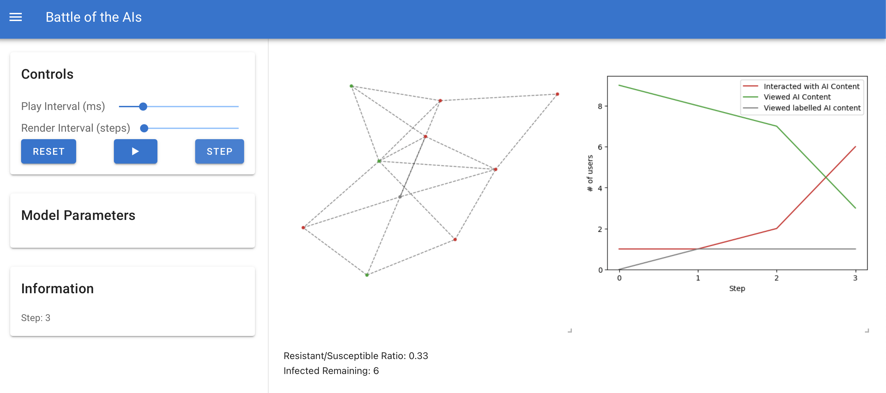
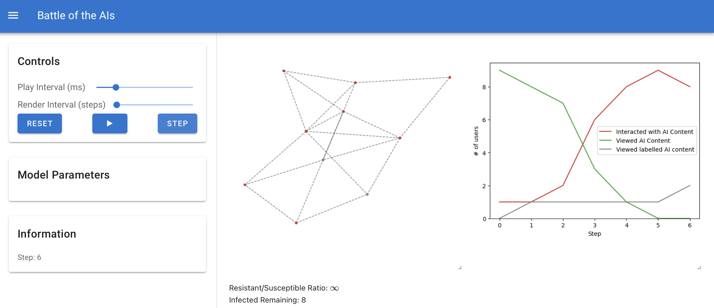
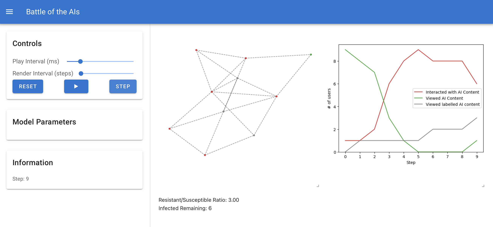
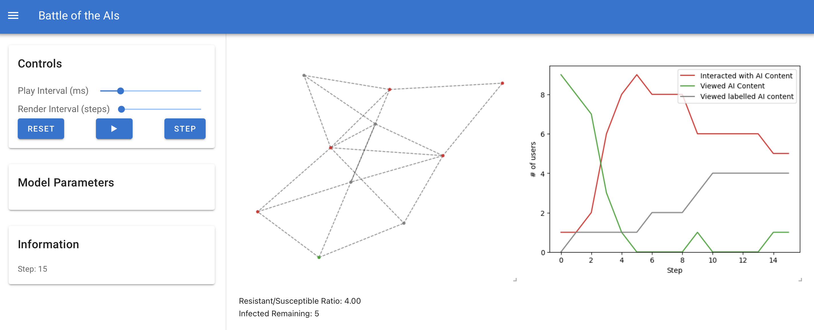
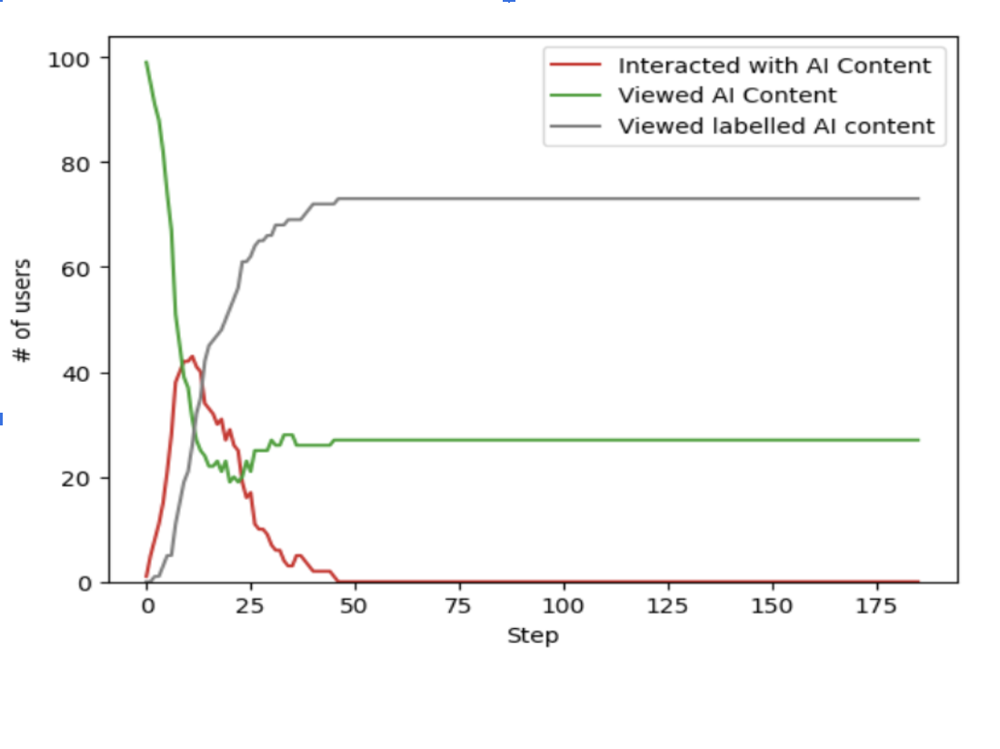

## Battle of the AIs: The Arms Race of Generative Content and Detection

```
Names : Leonel DE AMORIM, Christina PIANG SANG, Vidhi PANDYA
GitHub Link : https://github.com/vidhipandya29/battle-of-the-ais
```
## Phenomenon Overview

The phenomena that has been chosen is AI generated deep fake images and videos on social
media platforms with a focused interest on labelling such content. We aim to investigate if
labelling AI generated deep fake images affects its spread and whether labelling affects user
behaviour and interactions. The AI-to-AI interactions in this phenomenon is the battle between
the AI models to detect AI generated content and the AI bots creating such content and posting
them. Major social media platforms such as Meta and Instagram have taken the initiative to label
these AI-generated images and videos for transparency. (Meta, 2024) We can see this is a present
issue and one that has such large platforms working on tackling.

**Problem Statement:**
According to DeepMedia, by the end of 2025, it is expected that 8 million deepfake images and
videos will be shared on social media platforms, doubling every six months. (Jacobson, 2024).
AI generated content is growing fast and it can be used to mislead people on social media
platforms. As a result this may lead to growing disinformation narratives and misleading content.
This causes distorted views on social media platforms and is something that must be regulated.
Just think that without regulation users on online platforms can not tell what is real content and
what is AI generated causing real content and media to be lost among all the AI generated
content. Our simulation was created to visualize the relationship between AI generated content
and AI-detected content, exploring how user interactions on labeled/unlabeled content impact the
spread of this content.

**Agent-Based Modelling Approach:**
Agent-based modeling is a suitable approach for this phenomenon because there are several
entities involved in AI-generation of images and videos, such as user interactions with this
content, and AI-detection on social media platforms. These various interactions between users,
generated content and content detection require the use of Agent-Based Modelling to provide a
more detailed simulation of how humans interact with content on social media platforms. In this
case, Virus on a Network is used to show the spread of content that is AI-generated, interactions
of users with this content, and how the interactions potentially decrease when it is labelled as
AI-generated. Just like how a virus spreads through a network we can think of the AI generated
content as a virus and how we can detect and label the virus so it does not spread to users and so
users know what they are interacting with. As you can see the Agent-based model of virus on a
network is perfect to illustrate this.


**Phenomena Illustration**

Our agent-based model of AI content spread provides a clear visualization of how deepfakes
propagate through social networks and how detection systems respond. The simulation reveals
several key patterns that mirror real-world dynamics:

In the initial state, the network begins with primarily unexposed users (green nodes) and a small
number of users exposed to AI content (red nodes). This represents the moment when new
deepfake content first enters a social network, similar to when a fabricated political video or
celebrity deepfake is first uploaded to platforms like Twitter or TikTok.

During early spread (steps 3-6), we observe rapid propagation through highly connected nodes,
creating infection cascades. The visualization shows how content spread accelerates
exponentially as more users interact with the content. This mirrors the viral nature of sensational
AI-generated content in real platforms, where engagement metrics drive algorithmic
amplification.



At peak engagement (steps 6-9), the simulation shows maximum interaction with AI content,
visible in the chart as the red line reaches its apex. This critical window represents the period of
maximum impact before verification systems respond effectively, similar to how election-related
deepfakes achieve peak visibility before fact-checking occurs.



The detection and labeling phase (steps 9-15) demonstrates how resistant users (gray nodes)
begin to form clusters around detection sources. As labeled content awareness spreads, the
transmission rate declines. This reflects how platform labeling systems and digital literacy create
resistance to misinformation, similar to Twitter's Community Notes or Meta's fact-checking
partnerships.



Finally, the system reaches a dynamic equilibrium (steps 15-21) where generation and detection
forces balance each other. The visualization shows stable proportions of infected and resistant
users, with new infections continuing at a managed rate. This equilibrium closely resembles the
ongoing content moderation challenges on major platforms, where complete elimination of problematic content is never achieved but instead reaches a manageable steady state.



Our simulated patterns of spread, detection lag, and resistance formation align with documented
behaviors in social media ecosystems, providing valuable insights into potential intervention
strategies for real-world platforms.

## Simulation Design & Implementation

**System Overview**
The simulation implementation visualizes the spread of AI-generated deep fake content on a
social media platform. It features three key types of agents: regular users, AI-generation bots,
and AI-detection bots. The concept of the simulation is a “battle” between two AI systems,
generators that create and spread fake content, and detectors that detect and label content. This
creates an ecosystem where both human-to-AI and AI to AI interactions influence the growth
and reach of content on the social media platform.

**Simulation Environment**
Our model simulates AI content spread within a network-based environment that represents a
social media ecosystem. We implemented this using Mesa's Network class, which provides a
flexible framework for modeling complex social interactions. The environment is structured as
an Erdős–Rényi random graph, where nodes represent individual users and edges represent
social connections between them. This network topology captures the essential characteristics of
social media platforms where content can spread from user to user based on their connection
patterns. The random graph model creates a realistic distribution of connections, with some users
having many connections (influencers) and others having fewer (casual users).Within this
environment, information flows along network edges, simulating how content propagates
through social relationships. Each connection represents a potential pathway for AI content to
spread, and the structure of these connections significantly influences spread patterns.


**Agent Design**
There are three key agents implemented in the simulation. There are human users on the social
media platform, AI content generators that post deepfakes on the platform and AI detectors that
label the AI-generated content.
● **Human Users:** These are the users engaging with the content by liking, commenting
and sharing..
● **AI Content Generators** : These are the bots responsible for creating and spreading AI
Generated deep fake content.
● **AI Detectors:** These are the bots that detect and label AI generated content. They are the
adjudicators of deep fake content.

**Interaction Dynamics**
The simulation uses Mesa's RandomActivation scheduler, which activates agents in random
order during each step, creating unpredictable interaction patterns. The model focuses on user
interactions with the AI generated content and is presented in the following states:

1. **Susceptible:** Users who have been exposed to AI-generated content but have not
    interacted with it.
2. **Infected:** Users who have interacted with AI-generated content, contributing to its
    spread.
3. **Resistant:** Users who have become immune by recognizing AI detection labels, reducing
    the likelihood of further interaction.

The model tracks the number of users in each state and the changes from resistant to susceptible
and infected. The simulation continues to run until a maximum amount of steps is taken or until
no other interactions occur. The design is to highlight how content labelling and user behavior
are intertwined resulting in a connected influence into the spread of the AI generated content on
social media platforms.

**Data Collection & Visualization**
The simulation collects several key metrics through Mesa's DataCollector:

1. **User States** : Tracking Interacted(infected), Viewed(susceptible), and Labeled Content
    (resistant)
2. **Resistant to Susceptible Ratio** : Monitoring the ratio between the resistant and
    susceptible users to analyze the effectiveness of content labeling.

Visualization includes:

● Network visualization with color-coded nodes (red for users interacted with AI content,
green is for users who viewed AI content but not engaged with it, grey is for users users
who viewed labeled AI content and are resistant)
● Two time-series charts tracking user states over time showing how content spread and
resistance is developed
● Resistance/Susceptible/Infected Ratio that shows the ratio of each state in time as the
simulation progresses and how each influences the other.

The model collected data reveals that given the labelling there is a resistance that is formed
throughout the simulation. Through labelling the spread of the AI content is stagnated and the
label allows the users to gain resistance and not interact with the content presented moving from
susceptible to resistant.

## Preliminary Observations & Results

Early simulation results aligned with our phenomena of interest illustrating that labelling
AI deep fake content has an impact on how users engage with such content. Through our
simulations we have identified that effective labeling does impact how content is spread on a
platform. Our Resistance/Susceptible/Infected Ratio (Figure 1) demonstrates this effect visually,
showing the stark contrast between scenarios with and without active detection. When detectors
successfully label content, the proportion of grey nodes (labeled users) increases significantly,
creating natural barriers to further misinformation spread.





Through investigation the only way to combat the spread rate was an increase in detection rate
and accuracy rate. This makes sense as we had hypothesised beforehand that the best way to
reduce the engagement in Al deep fake content was for social platforms to implement detection
bots that can accurately detect the content and identify it correctly. When testing the detection
rate and detection accuracy it was found that an increase in these values allowed for the content
to significantly reduce its spread across a simulated platform. With better detection rate and
accuracy the spread of AI content was reduced this in turn allowed for unexposed users to go on
a longer time frame not being exposed to the content and as a result mitigate the spread. The
spread rate also plays a crucial role in the emergent behaviour as this dictates how quickly users
get engaged with the data before the detection systems are able to identify and label them.
Through these simulations and adjusting our variables to illustrate the various dynamics between
the users , AI content and AI detection we were able to clearly see how the effects of labeling AI
content is able to reduce the spread of AI generated content and impact the amount of users in a
platform that can engage with such content.


## Challenges & Next Steps

**Development Challenges**

Implementing this simulation presented several significant technical challenges. The most
difficult aspects included:

1. **Agent Interaction Complexity** : Creating a realistic model of how content
generators, detectors, and users interact requires balancing numerous parameters. The
effectiveness threshold for neutralizing generators (40%) proved particularly
challenging to calibrate for meaningful simulation outcomes.
2. **Visualization Integration** : Adapting Mesa's visualization framework to display
AI-to-AI interactions presented unexpected difficulties. The default ModularServer
implementation didn't support our custom HTML elements, requiring significant
refactoring of the visualization components.
3. **UI Layout Optimization** : The dashboard needed to simultaneously display
network dynamics, agent statistics, and temporal data without overwhelming users.
Our original design had elements competing for space, necessitating a complete
redesign to prioritize the network visualization while maintaining access to controls
and metrics.
4. **Performance Limitations** : As the number of agents increased, simulation
performance degraded significantly. We had to optimize the network algorithms and
limit the maximum agent count to maintain acceptable responsiveness.

We made several model adjustments due to unforeseen challenges:
· Simplified the content spread mechanics to focus on exposure status rather than
content virality metrics
· Reduced the complexity of detector AI decision-making to improve performance
· Modified how neutralized generators are handled to better visualize their state
changes

**Planned Refinements for the Final Report**

Before submission of DEL 4.B, we plan to develop, test, and refine the following aspects:

1. **Enhanced User Behavior Models** :
    · Implement differentiated user credibility scores to better represent
    real-world influence
    · Add content engagement mechanics (likes, shares, comments) as distinct
    interaction types
    · Test varied network structures to model different social media environments

2. **Advanced Detection Mechanics** :
    · Implement detection delay to more realistically model real-world lag
    between content creation and identification
    · Add false positive/negative rates to better simulate imperfect detection
    systems
    · Create adaptive generator behavior that responds to detection patterns
3. **Data Collection & Analysis Improvements** :
    · Implement detailed logging of all agent interactions for post-simulation
    analysis
    · Create exportable datasets of simulation runs for comparative analysis
    · Develop metrics to measure effectiveness of different detection strategies
    · Add time-series analysis tools to identify patterns in content spread
4. **UI/UX Enhancements** :
    · Implement interactive node inspection for detailed agent information
    · Add timeline visualization to better track the progression of the simulation
    · Create comparative view options to assess different parameter
    configurations simultaneously
    · Implement additional parameter options to increase interactiveness such as
    how users choose to engage with content once presented with label
5. **Mesa Dual Model Integration** :
    · Implement a second mesa agent based model such as Schelling
    Segregation Model to show how near by user interactions affect how users engage
    with content

These refinements will significantly enhance our analysis capabilities and provide more robust
findings on the dynamics between deepfake content generation and detection in social networks.


# References

1. _Labeling AI-generated images on Facebook, Instagram and threads_. Meta. (2024,
    February 14).
    https://about.fb.com/news/2024/02/labeling-ai-generated-images-on-facebook-instagram-
    and-threads/
2. Jacobson, N. (2024, February 26). _Deepfakes and their impact on society_. CPI OpenFox.
    https://www.openfox.com/deepfakes-and-their-impact-on-society/#:~:text=According%
    0to%20DeepMedia%2C%20in%202023,doubling%20deepfakes%20every%20six%20m
    onths
3. _Our approach to labeling AI-generated content and Manipulated Media_. Meta. (2024,
    September 12).
    https://about.fb.com/news/2024/04/metas-approach-to-labeling-ai-generated-content-and-
    manipulated-media/
4. Farrell, D. (n.d.). _Agent-based models in Python with Mesa and NetworkX._ Retrieved
    from https://dmnfarrell.github.io/bioinformatics/abm-mesa-network
5. Mesa Team. (n.d.). Virus on a Network. Mesa Documentation. Retrieved [Date], from
    https://mesa.readthedocs.io/latest/examples/basic/virus_on_network.html
6. Readthedocs. (n.d.). https://mesa.readthedocs.io/_/downloads/en/stable/pdf/
7. _Matplotlib.axes.axes.get_legend_handles_labels#_.
    matplotlib.axes.Axes.get_legend_handles_labels - Matplotlib 3.10.1 documentation.
    (n.d.).
    https://matplotlib.org/stable/api/_as_gen/matplotlib.axes.Axes.get_legend_handles_labels
    .html
8. Luna, E. de. (2024, June 24). _Photographers say meta is labeling their photos as being_
    _“made with ai” even when they’re not_. Mashable.
    https://mashable.com/article/meta-made-with-ai-label
9. Dogra, R. (2024, December 26). _AI-generated content surges on social media: New Study_
    _reveals Startling Trends_. AI World Today.
    https://www.aiworldtoday.net/p/research-shows-ai-generated-content-surges-on-social-m
    edia
10. CobainCobain 5111 silver badge33 bronze badges, & Anastasia
    ClarkAnastasia Clark 5633 bronze badges. (1960, October 1). _Altering_
    _legend labels in Matplotlib_. Geographic Information Systems Stack Exchange.
    https://gis.stackexchange.com/questions/174355/altering-legend-labels-in-matplotlib
11. Miles, M. (2025, January 24). _How to write a problem statement (with 3 examples)_.
    BetterUp. https://www.betterup.com/blog/problem-statement


# Attestation

| Name | Contributions | Planned Contributions |
|------|--------------|----------------------|
| Christina Piang Sang | Software, Methodology, Writing (Draft) - Developed AI model, wrote sections 2 & 4 | Will analyze ethical risks of model biases - implement final deliverable code base |
| Leonel De Amorin | Section 3, Draft report formatting and review, code review | Plan to implement enhancements to final deliverable code base |
| Vidhi Pandya | Section 1, Section 2, Code Implementation, Video Demo | Implement an additional MESA Example, Add frontend code |