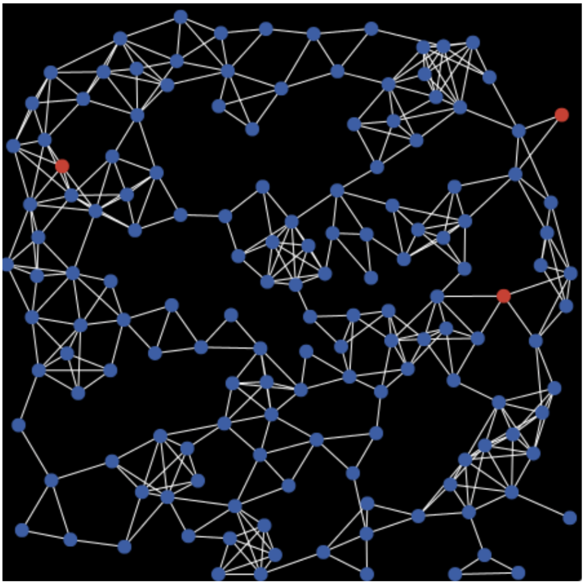
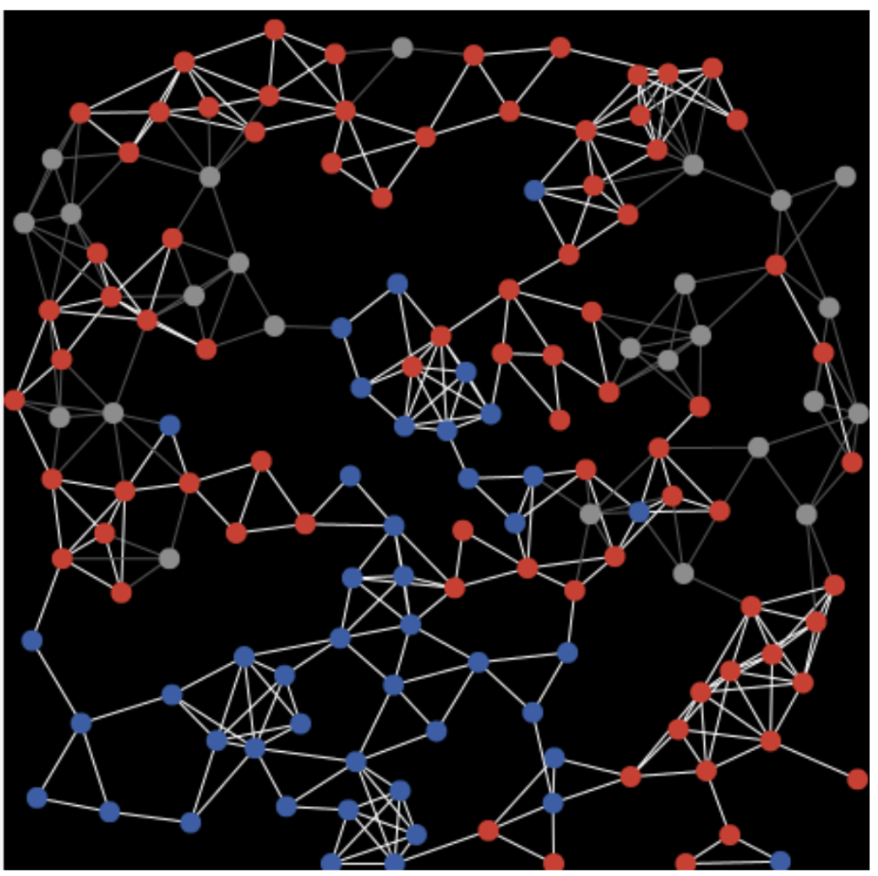
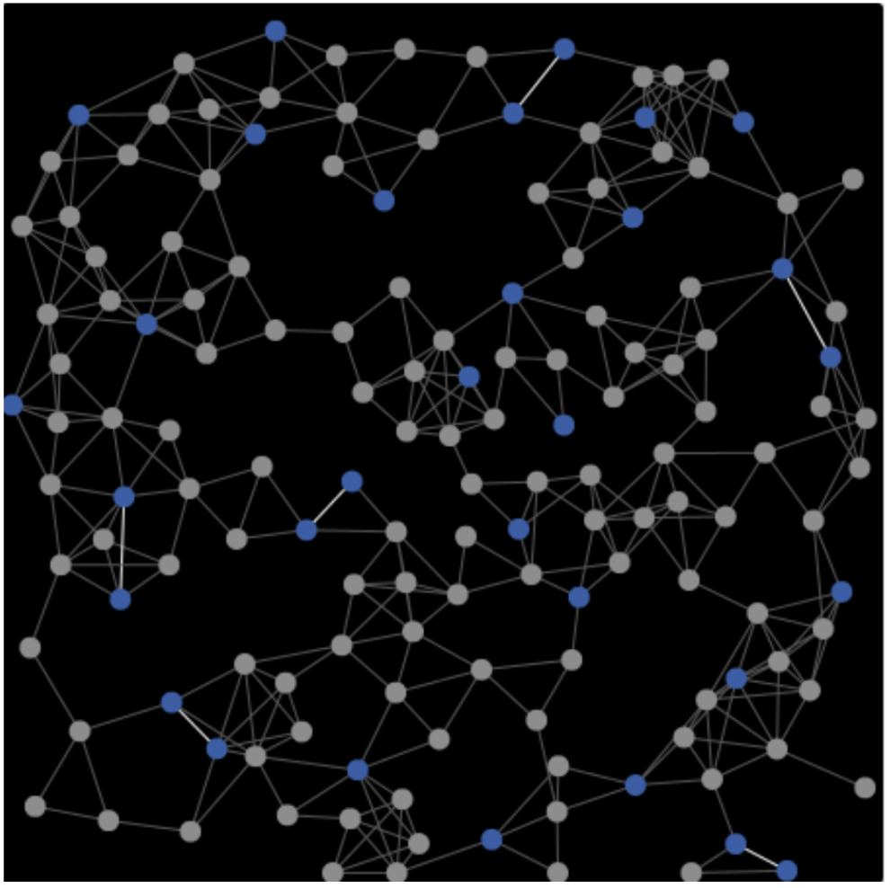
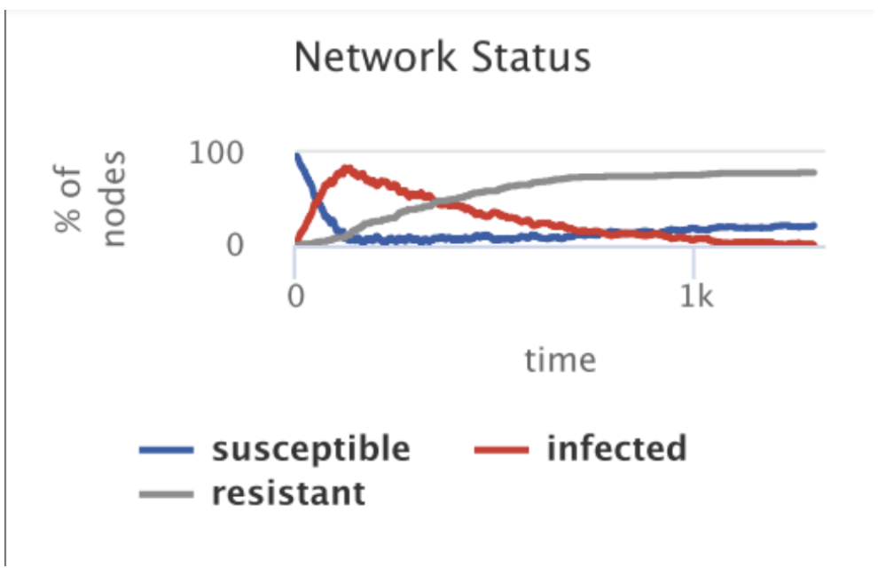

**Battle of the AIs: The Arms Race of Generative Content and Detection**

**Names**: Leonel DE AMORIM, Christina PIANG SANG, Vidhi PANDYA

**Github URL**: [https://github.com/vidhipandya29/battle-of-the-ais](https://github.com/vidhipandya29/battle-of-the-ais) 

### **Section 1: Phenomena of interest.**

The phenomena of interest is AI generated deep fake images and videos with a focused interest on Instagram and Meta’s  effort to label such content. We aim to simulate how users interact with both labeled and unlabeled AI generated content by modelling engagement patterns such as likes, shares and comments. This will help illustrate how labelling AI generated deep fake images affects its spread and whether labelling affects user behaviour and interactions. We will also simulate the effectiveness and challenges of  AI detection on these platforms highlighting the AI-to-AI (bot vs bot) interactions. The first bot is responsible for creating and sharing deep fake content while the second bot detects AI-generated content and labels it. Mislabeling errors and delayed labelling are key aspects we will investigate to understand their impact on user interactions along with the challenges in labelling AI generated content. Understanding these factors will provide insight into the dynamic relationship between the users behaviour/interactions, content labelling and content spread. The race between content dissemination and detection lies in the moment of the initial post to when it is detected and labelled. Accuracy and speed of detection will directly affect content labelling and in turn potentially affect user behaviour and content spread. 

### **Section 2: Phenomena of interest.**

1. *Labeling AI-generated images on Facebook, Instagram and threads*. Meta. (2024, February 14). [https://about.fb.com/news/2024/02/labeling-ai-generated-images-on-facebook-instagram-and-threads/](https://about.fb.com/news/2024/02/labeling-ai-generated-images-on-facebook-instagram-and-threads/) 

This paper has been published by Meta. It discusses the initiative to label content posted on various social media platforms run by Meta such as Instagram and Facebook if detected as AI-generated. This includes video and audio. Although AI Development is rapidly growing and can be used to one’s advantage, it can also mislead the general public, especially on social media. To decrease misinformation, Meta aims to label content to ensure transparency with their users. The paper discusses the various techniques they will use to detect AI such as recognizing invisible watermarking and allowing users to disclose when they share AI-generated content. Additionally, it discusses how these labels will vary based on how harmful the shared content will be. For example, if it is intentionally deceiving, a more prominent label will be added. Overall, it focuses on the potential implications of growing AI development and how it will be monitored on social media platforms.

2. Wittenberg, C., Epstein, Z., Berinsky, A. J., Rand, D. G., & MIT Sloan School of Management. (2023). *Labeling AI-Generated Content: Promises, perils, and future directions*. [https://computing.mit.edu/wp-content/uploads/2023/11/AI-Policy_Labeling.pdf](https://computing.mit.edu/wp-content/uploads/2023/11/AI-Policy_Labeling.pdf) 

         The paper discusses the role of labelling AI generated content and providing visible warning labels to inform users of the type of content they are engaging in. The paper outlines that there must be focus on two objectives when developing the framework to label this content. The first is processed based  meaning identifying the process by which a given piece of content was created or modified. The second is impact based meaning focusing on the contents potential harm such as  the use of deep fakes.  The paper places importance on the need for an effective and scalable AI detection  system along with the challenges that may come such as mislabeling and the impact this has on public trust and content spread.

### **Section 3: Describe the Core Components of the Simulation**

The Mesa model, Virus on a Network is the best way to represent our phenomena of interest. The Mesa Virus on a Network model is well suited for our project because it effectively simulates how deep fake content spreads through social media, similar to how a virus spreads in a network.

 

In order to use the Virus on a Network model, we will follow the SIR model structure to display users on the social media platform and how their interactions impact the visibility of deep fake posts. The first aspect of the SIR model are the **Susceptible** users. This represents the users that have been exposed to the deep fake content on their feed allowing them to potentially interact by liking, commenting or sharing. The second aspect of this model are the **Infectious** users. This represents the users that have interacted with the content by liking, commenting or sharing. The third aspect of this model are the **Recovered/Immune** users. This represents the users that see the AI-Detection label on the deep fake content, making them “immune” to further spread it.

**Entities:**
* **Human Users:** These are the users engaging with the content by liking, commenting    and sharing..
* **AI Content Generators**: These are the bots responsible for creating and spreading AI Generated deep fake content.          
* **AI Detectors:** These are the bots that detect and label AI generated content. They are the  adjudicators of deep fake content

**Affordances**:
* **Engagement Actions:**  Users actions such as Liking, Commenting,Sharing 
* **Adjudication:** This is the AI bots who detect and label deep fake content 
* **Emotional Responses:** The content may elicit emotional response such as humor or  anger 

A Mesa example corresponding with this is the Schelling Segregation Model. This model simulates how agents move based on neighbourhood preferences. User engagement such as liking, commenting and sharing influence how others may interact with the content and this model could illustrate this.

**Algorithms:**
* **Recommendation Algorithm:**  This algorithm is used to prioritize and target content to a user based on the users engagement. An example of an analogy to illustrate this using a Mesa model is the Schelling Segregation Model. This model simulates how agents move based on neighbourhood preferences similar to how users engage with similar content based recommendations pushed. 
* **Detection Algorithm:** This algorithm would use AI to improve the content identification adapting to the change and emergence of new AI generated content. An example of a Mesa model is the Wolf-Sheep Predation Model. This model would illustrate the dynamic between the detector bots (the wolves) and the AI content generators (the sheep) as they adapt and change in a cat and mouse game of content creation and detection.

### **Section 4: Simulation Anticipated Outcomes**

Given our phenomenon of interest and our success in the simulation we would show that labelling AI generated deep fake content has a large impact on the users interactions. In fact once users are informed that the content they are consuming is AI generated they will not share, like or comment on it resulting in such content not spreading as much as it would if it were not labelled. Using the Virus on a network model we will have presented the following node diagrams below illustrating this phoneme.

* **The Nodes:** There are representative of the users on the social media
* **The Node Colours:**
    * **Blue:** This represents users on the social media platform who have not yet been exposed to the AI-Content
    * **Red:** This represents users who have been exposed to the AI content
    * **Grey:** This represents users who have been exposed to the AI content with a label
* **The Edges:** These are representative of the users interactions such as liking, sharing and comments

| **Image** | **Description** |
|-----------|---------------|
|  | This shows the social media platform with many users who have not yet been exposed to the AI-generated content. However, a few have been exposed to it. |
|  | This shows how many users become exposed to the AI-generated content through interactions (liking, sharing, commenting, etc).  This is early in the AI-detection as few users are able to see the AI detection label, resulting in a rapid increase in users who have been exposed to AI content. |
|  | This displays how the increase in AI-labelling decreases the number of interactions and therefore, decreases the number of users exposed to AI-generated content. This shows that with effective labeling, there is a drastic drop in the spread of AI-generated deep fake content. |
|  | We also have the following SIR line graph representing this change over time. We can see how before such content is labeled, there is a rapid increase in exposed nodes (Red Line) as users engage with the content without being aware it is AI-generated. This red line reaches a peak early on before AI labels have been added (Grey Line).  The grey line represents users exposed to the detection label and not engaging with the content once aware it is AI-generated. More and more users begin to disengage, reducing the spread of AI-generated media. |
